> [!NOTE]
> **Archived.** This repo is part of [Cortex](https://github.com/cortex-io), which is no longer under active development. It is kept as a working record: explore, fork and borrow freely, but no fixes or features are planned.

<a href="https://github.com/cortex-io"><b>Cortex</b></a> &nbsp;·&nbsp; <a href="https://github.com/cortex-io/cortex">cortex</a> · <a href="https://github.com/cortex-io/cortex-platform">cortex-platform</a> · <a href="https://github.com/cortex-io/cortex-gitops">cortex-gitops</a> · <a href="https://github.com/cortex-io/cortex-k3s">cortex-k3s</a> · <a href="https://github.com/cortex-io/cortex-docs">cortex-docs</a> · <b>cortex-construction-hq</b> · <a href="https://github.com/cortex-io/infrastructure-docs">infrastructure-docs</a>

## What was built

Cortex organized its autonomous-infrastructure work with a **construction-company metaphor**: divisions run by general managers, with contractor agents bringing domain expertise. This repo was the project office.

| Phase | Scope | Status |
|:--:|---|---|
| 1 | MCP Server Foundation: 9 MCP servers, 113+ tools | ✅ complete |
| 2 | Organizational Hierarchy: division structure, 7 GM templates, 3 contractor agents | ✅ complete |
| 3 | n8n Enhancements: retry logic, webhook management, 108 tests | ✅ complete |
| 4 | Agent Intelligence Layer | ○ not started |
| 5 | Resource Manager Integration | ○ not started |
| 6 | Union/Non-Union Permit System | ○ not started |
| 7 | Production Deployment | ○ not started |
| 8 | Advanced Features: multi-region, self-healing, NLP | ○ not started |

## By the numbers

~47,000 lines of code · 108 test cases · 23+ parallel agent streams · 50+ agents spawned

## Files

- [ROADMAP.md](ROADMAP.md): the full phase plan, including the unbuilt phases 4–8
- [SESSION-LOG.md](SESSION-LOG.md): build-session logs

---

Part of the <a href="https://github.com/cortex-io">Cortex archive</a> · built with Claude

